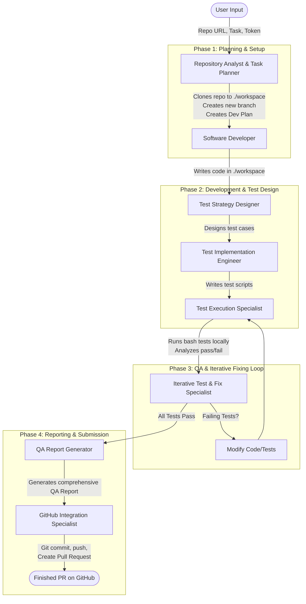
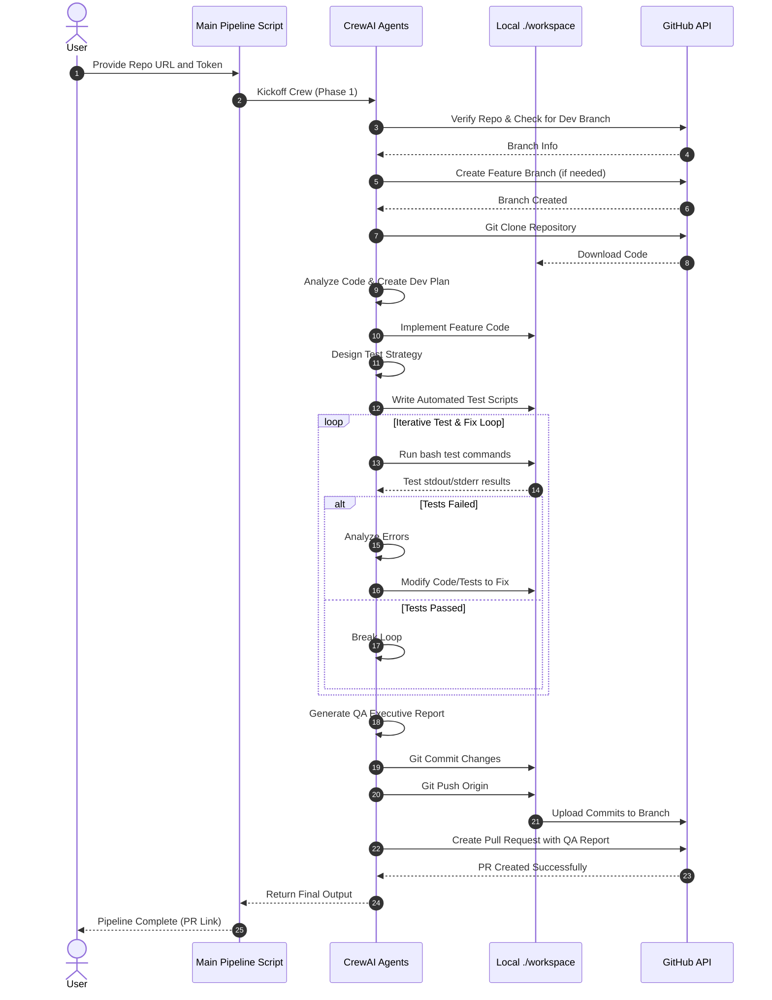

# Iterative QA Pipeline CrewAI - Workflow Explanation

This document explains the complete end-to-end workflow of the Iterative Quality Assurance Pipeline. 

The pipeline uses **CrewAI** to orchestrate a team of specialized AI agents that autonomously analyze, implement, test, fix, and submit code back to a GitHub repository.

## High-Level Architecture

When you run the script, the following process takes place sequentially:

### UML Sequence Diagram

Here is a detailed UML Sequence Diagram focusing on the interactions between the User, GitHub, and the CrewAI Agents over the lifecycle of the process:

---

## The Agents and Their Roles

Here is exactly what each AI "Agent" does behind the scenes during a run:

### 1. 🕵️ Repository Analyst and Task Planner
- **What it does:** Looks at the GitHub repository you provided.
- **Actions:** Uses the GitHub tools to find the default branch, creates a new `feature/...` branch remotely, and clones it to your local `./workspace` folder. It then analyzes the code and creates a step-by-step development plan.

### 2. 💻 Software Developer
- **What it does:** Implements the requested features.
- **Actions:** Directly edits, creates, or modifies files inside the local `./workspace` directory to fulfill your initial prompt.

### 3. 🧪 Test Strategy Designer
- **What it does:** Decides how the new code should be tested.
- **Actions:** Writes a comprehensive test plan (Unit tests, Integration tests, etc.) ensuring all edge cases are covered.

### 4. ⚙️ Test Implementation Engineer
- **What it does:** Writes the actual test code.
- **Actions:** Creates the automated test scripts (e.g., `pytest`, `jest`, etc.) inside the `./workspace` directory based on the designer's strategy.

### 5. 🏃‍♂️ Test Execution Specialist
- **What it does:** Runs the tests to see if the code works.
- **Actions:** Uses the `BashExecutionTool` to execute the test commands locally. It reads the terminal output to figure out what passed and what failed.

### 6. 🔄 Iterative Test and Fix Specialist (The Loop)
- **What it does:** Acts as the automated debugger.
- **Actions:** If the Test Execution agent finds errors, this agent kicks in. It modifies the code in `./workspace` to fix the bugs, then has the tests run again. **This loop continues until all tests pass.**

### 7. 📝 QA Report Generator
- **What it does:** Documents the entire process.
- **Actions:** Creates a comprehensive executive Quality Assurance report detailing what was built, what was tested, and any discovered risks.

### 8. 🚀 GitHub Integration Specialist
- **What it does:** Submits the final, validated code back to GitHub.
- **Actions:** Uses local `git` commands to seamlessly commit all the changes in `./workspace` and push them to the new remote branch. Finally, it uses the GitHub API to open a **Pull Request** containing the final code and the QA report.

---

## Required Environment Setup

For this workflow to run smoothly, two things are required:
1. **Model API Key**: Currently configured in `crew.py` to use Alibaba Cloud Model Studio (`qwen-plus`).
2. **GitHub Token**: A Personal Access Token stored as `$env:GITHUB_AUTH_TKN` with `repo` permissions to allow the agents to clone, push, and create Pull Requests.
